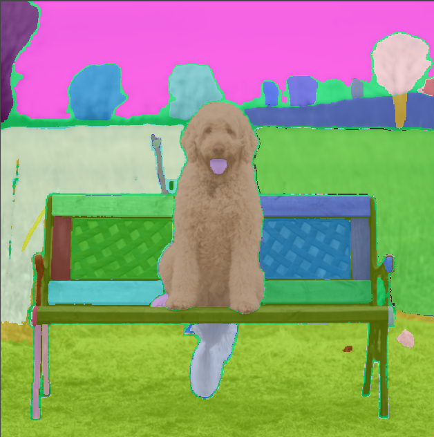
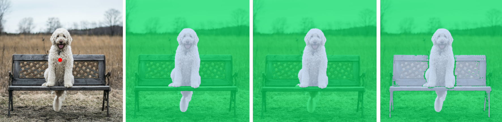
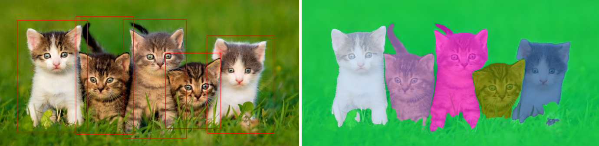
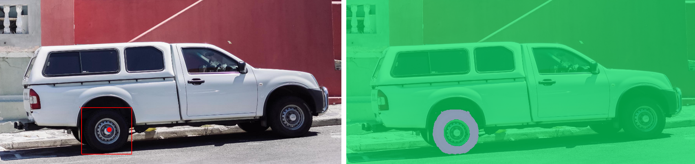

# infer_segment_anything

The Segment Anything Model (SAM) offers multiple inference modes for generating masks:
1. Automated mask generation (segmentation over the full image)
2. Segmentation masks from prompts (bounding boxes or points)

The SAM model can be loaded with three different encoders: ViT-B, ViT-L, and ViT-H. The encoders differ in parameter counts, with ViT-B containing 91M, ViT-L containing 308M, and ViT-H containing 636M parameters. Keep in mind that encoder size also affects inference speed, so choose the appropriate encoder based on your specific use case.


## :rocket: Inference with Ikomia API

``` python
from ikomia.dataprocess.workflow import Workflow
from ikomia.utils.displayIO import display

# Init your workflow
wf = Workflow()    

# Add SAM algorithm
sam = wf.add_task(name="infer_segment_anything", auto_connect=True)

sam.set_parameters({ 
    'model_name': 'vit_b',
    # 'points_per_side' : '32', # Automatic mask generation used when no graphics prompt is provided
    'input_size_percent': '100',
    # 'mask_id': '1', # for inference from single point prompt: 1, 2 or 3
    'draw_graphic_input': 'True', # Set to true for drawing graphics using the API
    # 'input_point': '[[xy], [xy]]', # use prompt coordinate instead of drawing graphics
    # 'input_point_label' : '[1,0]',
    # 'input_box': '[[xyxy], [xyxy]]', # use prompt coordinate instead of drawing graphics
}) 

# Run on your image  
wf.run_on(url="https://raw.githubusercontent.com/Ikomia-dev/notebooks/main/examples/img/img_dog.png")


# Inspect your results
display(sam.get_image_with_mask())
```

## 1. Automated mask generation
When no prompt is used, SAM will generate masks automatically over the entire image. 
You can select the number of masks using the parameter "Points per side" on Ikomia STUDIO or "points_per_side" with the API. Here is an example with ViT-H using the default settings (32 points/side).  




## 2. Segmentation mask with graphic prompts:
Given a graphic prompts: a single point or boxes SAM can predict masks over the desired objects. 
- Ikomia API: 
    - Using graphics: Set the parameter draw_graphic_input=True to draw over the image.
        - Point: A point can be generated with a left click
        - Box: Left click > drag > release
    - Using prompt coordinate
        - Point: 'input_point' parameter, e.g. [xy] or [[xy], [xy]]
        - Point label: 'input_point_label' parameters, e.g. [1,0] 1 to include, 0 to exclude from mask
        - Box: 'input_box' parameter, e,g, [xyxy] or [[xyxy], [xyxy]].


- Ikomia STUDIO:
    - Using graphics
        - Point: Select the point tool
        - Box: Select the Square/Rectangle tool
    - Using coordinate prompts
        - Point: 'Point coord. xy (optional)' [[xy], [xy]]
        - Point label: [1,0], 1 to include, 0 to exclude from mask
        - Box: 'Box coord. xyxy (optional)' [[xyxy], [xyxy]]

### a. Single point 
SAM with generate three outputs given a single point (3 best scores). 
You can select which mask to output using the mask_id parameters (1, 2 or 3) 



### b. Multiple points
A single point can be ambiguous, using multiple points can improve the quality of the expected mask.

### c. Boxes
Drawing a box over the desired object usually output a mask closer to expectation compared to point(s). 

SAM can also take multiple inputs prompts.



### d. Point and box

Point and box can be combined by including both types of prompts to the predictor. Here this can be used to select just the trucks's tire, instead of the entire wheel.

